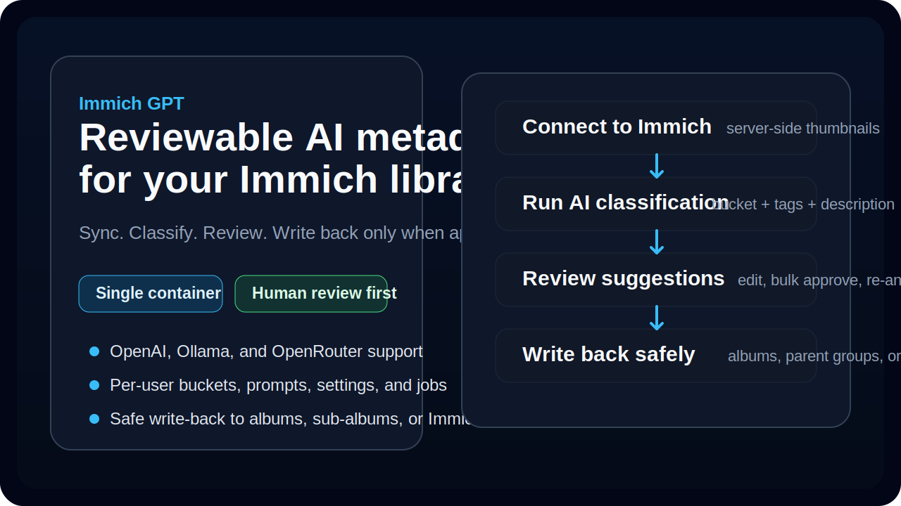
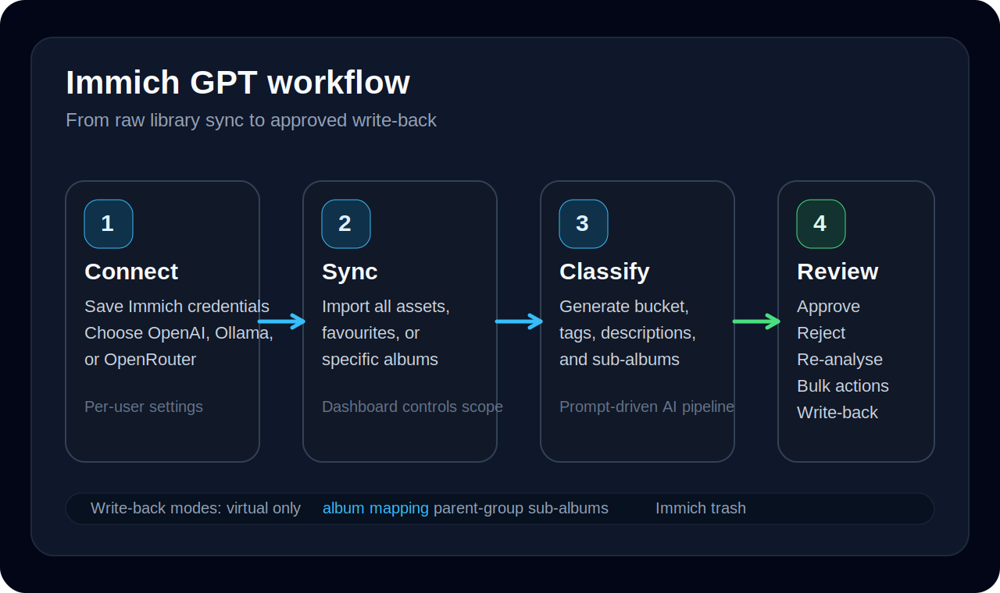

# Immich GPT

AI-assisted metadata enrichment for Immich, with human review before anything is written back.



Immich GPT helps you turn a large Immich library into a reviewable workflow:

- Sync all assets, favourites, or selected albums from Immich
- Classify assets into buckets such as `Documents`, `Business`, `Personal`, and `Trash`
- Generate descriptions, tags, and album/sub-album suggestions with AI
- Review every suggestion before write-back
- Organise safely with OpenAI, Ollama, or OpenRouter
- Run as a simple single-container app, with optional Redis if you already use it

## Why people use it

Immich GPT is built for people who want AI help without giving up control.

- **Human-in-the-loop by default**: nothing is written automatically just because the model suggested it
- **Immich credentials stay on the server**: thumbnails are proxied server-side before AI processing
- **Works for messy real libraries**: documents, work photos, family media, cleanup candidates, and more
- **Multi-user ready**: each user gets their own settings, providers, jobs, buckets, prompts, and review queue

## What changed recently

This README reflects the latest merged work on the repo, including:

- **Multi-user auth and admin controls** with login, password reset, and per-user data ownership
- **Single-image deployment** as the default path; Redis is now optional instead of bundled
- **Sync scopes** for all assets, favourites only, or specific albums
- **Richer review tools** including re-analyse, cross-page select-all, and bulk actions
- **Better asset operations** such as server-side filtering, sorting, and batch re-classification
- **Provider improvements** for OpenAI, Ollama, and OpenRouter
- **Immich Trash mapping mode** for cleanup-focused buckets

## How it works



1. **Connect Immich**
   - Save your Immich URL and API key in Settings
   - Optionally configure your AI provider there too
2. **Sync assets**
   - Pull your full library, favourites, or just selected albums
3. **Run classification**
   - AI analyses each asset and suggests a bucket, description, tags, and optional album/sub-album metadata
4. **Review and approve**
   - Edit the suggestion, bulk-approve, reject, re-analyse, or write back to Immich when you are happy

## Main screens

| Page | What it is for |
|------|-----------------|
| `Dashboard` | Sync assets, launch classification, watch recent jobs, and see library stats |
| `Review` | Approve, reject, edit, bulk-handle, and re-analyse AI suggestions |
| `Assets` | Browse synced assets, filter and sort them, inspect details, and re-classify selected items |
| `Buckets` | Define categories, priorities, prompts, confidence thresholds, and mapping behavior |
| `Prompts` | Tune global prompts, bucket prompts, and review guidance |
| `Jobs` | Track progress, inspect logs, pause, resume, cancel, and clean up terminal jobs |
| `Audit Logs` | Inspect write-back activity and operational events |
| `Settings` | Configure Immich, AI providers, and AI behavior rules |
| `Admin Users` | Create and manage users in multi-user setups |

## Feature highlights

### Safe AI pipeline

- One reviewable suggestion per asset
- Structured model output with schema validation
- Errors are surfaced instead of silently swallowed
- Immich asset URLs are never handed directly to external AI providers

### Review-first workflow

- Always-editable review cards for description, tags, bucket, and album/sub-album
- Bulk approve, bulk reject, and bulk re-analyse
- Cross-page select-all on both review and assets flows
- Large preview on click for image inspection

### Flexible write-back behavior

Each bucket can choose its own mapping mode:

| Mapping mode | Result after approval |
|--------------|-----------------------|
| `virtual` | Keep the classification inside Immich GPT only |
| `immich_album` | Add the asset to a chosen Immich album |
| `parent_group` | Create or use sub-albums under a parent bucket grouping |
| `immich_trash` | Move the asset to Immich's trash for cleanup workflows |

### Provider support

| Provider | Best for |
|----------|----------|
| `OpenAI` | Hosted vision models with minimal setup |
| `Ollama` | Local/self-hosted models |
| `OpenRouter` | Trying different hosted model families through one API |

### Operations and control

- Pause, resume, cancel, and inspect jobs
- Real-time progress views and job logs
- Audit trail for review and write-back operations
- Per-user ownership of assets, settings, prompts, providers, and jobs

## Quick start

### Docker Compose

1. Copy the example env file:

   ```bash
   cp .env.example .env
   ```

2. Edit `.env` and set at least:
   - `IMMICH_URL`
   - `IMMICH_API_KEY`
   - `ADMIN_EMAIL`
   - `ADMIN_PASSWORD`

   `OPENAI_API_KEY` is optional if you plan to configure Ollama or OpenRouter in the UI after first login.

3. Start the app:

   ```bash
   docker compose up -d
   ```

4. Open `http://localhost:8000`

5. Sign in with the bootstrap admin account from `.env`

6. You will be asked to change the password on first login

7. In **Settings**:
   - save and test the Immich connection
   - choose your AI provider

8. In **Dashboard**:
   - sync your assets
   - start a classification job

9. In **Review**:
   - approve, edit, reject, or re-analyse suggestions

> Bootstrap admin env vars are only used to create the first admin account when the database has no users yet.

## Deployment notes

- **Recommended**: single container with built-in worker threads
- **Optional**: point `REDIS_URL` at an existing Redis instance if you already run one
- **Unraid**: supported via the Community Apps template

For detailed deployment examples, see [`DOCKER.md`](DOCKER.md).

## Default buckets

Fresh user accounts start with these defaults:

| Bucket | Purpose |
|--------|---------|
| `Documents` | Receipts, invoices, forms, scans, screenshots, and paper photos |
| `Business` | Work sites, tools, project documentation, and job-related media |
| `Personal` | Family, travel, hobbies, food, events, and everyday life |
| `Trash` | Blurry, accidental, duplicate, or no-value shots |

`Documents` is intentionally higher-priority than `Business` when an asset is clearly a receipt, invoice, contract, or scan.

## Environment variables

| Variable | Default | Description |
|----------|---------|-------------|
| `IMMICH_URL` | *(empty)* | Immich server URL |
| `IMMICH_API_KEY` | *(empty)* | Immich API key |
| `OPENAI_API_KEY` | *(empty)* | OpenAI API key |
| `OPENAI_MODEL` | `gpt-4o` | Default OpenAI model |
| `ADMIN_EMAIL` | *(empty)* | Bootstrap admin email for the first launch |
| `ADMIN_PASSWORD` | *(empty)* | Bootstrap admin password for the first launch |
| `ADMIN_USERNAME` | `admin` | Bootstrap admin display name |
| `APP_PORT` | `8000` | Host port used by Docker Compose |
| `WORKER_CONCURRENCY` | `2` | In-process background worker threads |
| `REDIS_URL` | *(empty)* | Optional Redis URL if you want RQ-backed jobs |
| `DATABASE_URL` | `sqlite:////data/immich_gpt.db` | Database path/URL |
| `SECRET_KEY` | `change-me-in-production` | Session/token secret |
| `AUTH_ENABLED` | `false` | Legacy bearer-token gate for `/api/*` routes |

## API at a glance

| Method | Path | Description |
|--------|------|-------------|
| GET | `/api/health` | Health check |
| GET/POST | `/api/settings/immich` | Immich settings |
| GET/POST | `/api/settings/providers` | Provider configuration |
| GET/POST/PATCH/DELETE | `/api/buckets` | Bucket CRUD |
| GET/POST/PATCH/DELETE | `/api/prompts` | Prompt CRUD |
| GET | `/api/assets` | Asset list |
| GET | `/api/assets/count` | Asset count |
| GET | `/api/assets/ids` | All matching asset IDs for bulk actions |
| POST | `/api/assets/reclassify` | Re-classify selected assets |
| POST | `/api/jobs/sync` | Start sync job |
| POST | `/api/jobs/classify` | Start classification job |
| GET | `/api/jobs/{id}` | Job details and logs |
| GET | `/api/jobs/{id}/stream` | SSE job stream |
| GET | `/api/review/queue` | Review queue |
| GET | `/api/review/queue/ids` | Matching review IDs for bulk actions |
| POST | `/api/review/item/{id}/approve` | Approve a suggestion |
| POST | `/api/review/item/{id}/reject` | Reject a suggestion |
| GET | `/api/albums` | Immich albums |

## Local development

### Backend

```bash
cd backend
python3 -m pytest tests/ -v
```

### Frontend

```bash
cd frontend
npm test
npm run lint
npx tsc --noEmit
```

### Dev servers

```bash
redis-server --daemonize yes
cd backend && REDIS_URL=redis://localhost:6379/0 uvicorn app.main:app --host 0.0.0.0 --port 8000
cd frontend && npx vite --host 0.0.0.0 --port 3000
```

Redis is optional. Leave `REDIS_URL` empty to run jobs in-process instead.

## Tech stack

| Layer | Technology |
|-------|------------|
| Backend | Python 3.12, FastAPI, SQLAlchemy, Alembic |
| Frontend | React 18, TypeScript, Vite, React Query |
| Database | SQLite by default |
| Background work | Built-in thread pool or optional Redis + RQ |
| AI providers | OpenAI, Ollama, OpenRouter |
| Packaging | Docker, Docker Compose, Unraid |

## Roadmap

- [ ] Stronger live-updating UI around job streams
- [ ] Video thumbnail and richer media support
- [ ] Duplicate/junk heuristics before AI analysis
- [ ] Face/people-aware Immich enrichment
